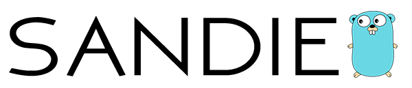

# Pure-go [SANDIE](../README.md)



## Installation

### Build steps

In order to build the main applications for this project run:
```console
user@cms:~$ make
```

The resulting programs are being place inside: **$GOPATH/bin**.

### Docker packaging

See [`/docker`](./docker) for more information.

## Go Directories

#### `/cmd`

Main applications for this project. For more information and examples see:

* [`/cmd/sandie-consumer`](./cmd/sandie-consumer)

#### `/docker`

Dockerfile and auxiliary files used for building Docker images to run the main pure-go applications of this project
as well as the [NDN-DPDK](https://github.com/usnistgov/ndn-dpdk) forwarder.

#### `/internal`

Internal logic of all main applications in this project as well as auxiliary packages. Parts of code present inside
[`/internal/pkg`](./internal/pkg) will eventually be go-gettable.

## License

This software collection is using third-party code developed under National Institute of Standards and Technology License,
see [NDN-DPDK.LICENSE.md](./NDN-DPDK.LICENSE.md) for more information.

This software collection is distributed under the MIT License, see [LICENSE.md](../LICENSE.md) for more information.